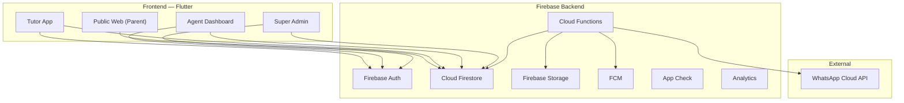
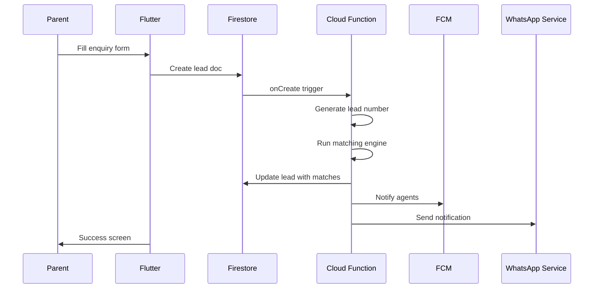
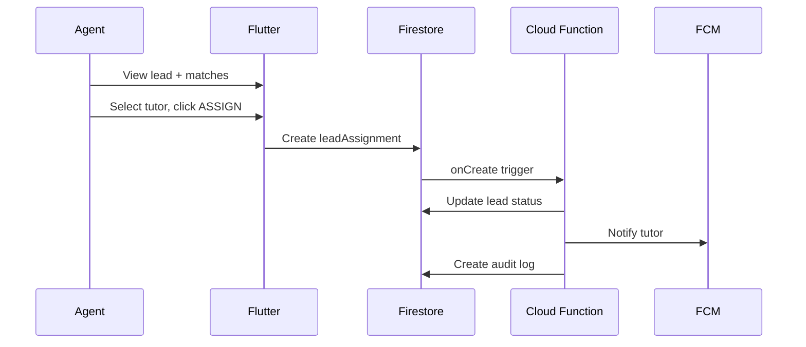
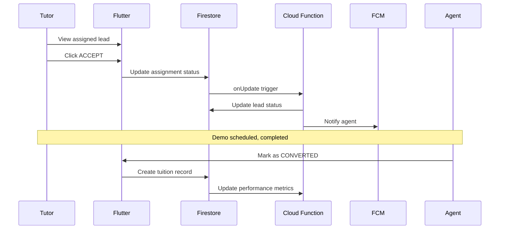

# Expert Tutors Academy — Implementation Plan

## Overview

A production-ready full-stack ERP for a home tuition agency, built with **Flutter + Firebase**. The system manages the complete lifecycle: Parent Enquiry → Lead → Tutor Matching → Assignment → Demo → Conversion → Tuition Tracking → Analytics.

---

## Architecture



### Clean Architecture Layers

```
lib/
├── core/                    # Shared utilities, constants, theme, errors
│   ├── theme/               # Design system tokens
│   ├── constants/           # App-wide constants
│   ├── errors/              # Failure classes
│   ├── utils/               # Helpers, formatters, validators
│   └── widgets/             # Reusable design system widgets
├── config/                  # Routes, DI, environment config
├── data/                    # Data layer
│   ├── models/              # Firestore data models (fromJson/toJson)
│   ├── repositories/        # Repository implementations
│   └── services/            # Firebase service wrappers
├── domain/                  # Business logic
│   ├── entities/            # Domain entities
│   ├── repositories/        # Repository interfaces (abstract)
│   └── usecases/            # Use cases
├── presentation/            # UI layer
│   ├── providers/           # Riverpod providers / state management
│   ├── pages/               # Screen pages
│   └── widgets/             # Screen-specific widgets
└── main.dart
```

### State Management: **Riverpod** (flutter_riverpod)

Chosen for: compile-time safety, testability, proper disposal, no context dependency for logic.

---

## Phased Delivery

### Phase 1 — Foundation (Current Session)
| # | Deliverable | Status |
|---|-------------|--------|
| 1 | Flutter project scaffold + clean architecture | 🔲 |
| 2 | Design system (theme, tokens, reusable widgets) | 🔲 |
| 3 | Firebase configuration files | 🔲 |
| 4 | Firestore data models (all collections) | 🔲 |
| 5 | Authentication + Role system | 🔲 |
| 6 | Public homepage + Enquiry form | 🔲 |
| 7 | Lead creation flow (Firestore write) | 🔲 |

### Phase 2 — Core Operations
| # | Deliverable | Status |
|---|-------------|--------|
| 8 | Tutor registration + profile | 🔲 |
| 9 | Agent dashboard | 🔲 |
| 10 | Lead management screens | 🔲 |
| 11 | Smart matching engine | 🔲 |
| 12 | Lead matching screen (split view) | 🔲 |
| 13 | Manual + automatic assignment | 🔲 |

### Phase 3 — Operational Workflows
| # | Deliverable | Status |
|---|-------------|--------|
| 14 | Tutor leads screen (accept/decline) | 🔲 |
| 15 | Reassignment workflow | 🔲 |
| 16 | Demo scheduling | 🔲 |
| 17 | Follow-up engine | 🔲 |
| 18 | Tuition management | 🔲 |
| 19 | Conversion flow | 🔲 |

### Phase 4 — Intelligence & Analytics
| # | Deliverable | Status |
|---|-------------|--------|
| 20 | Tutor performance engine | 🔲 |
| 21 | Analytics dashboard | 🔲 |
| 22 | Lead funnel | 🔲 |
| 23 | Search & filtering | 🔲 |

### Phase 5 — Backend & Security
| # | Deliverable | Status |
|---|-------------|--------|
| 24 | Cloud Functions (matching, notifications, audit) | 🔲 |
| 25 | Firestore security rules | 🔲 |
| 26 | Storage security rules | 🔲 |
| 27 | WhatsApp integration service | 🔲 |
| 28 | FCM notifications | 🔲 |
| 29 | Audit log system | 🔲 |
| 30 | Notification center | 🔲 |

### Phase 6 — Polish & Testing
| # | Deliverable | Status |
|---|-------------|--------|
| 31 | Seed data generator | 🔲 |
| 32 | Empty/error/loading states everywhere | 🔲 |
| 33 | Responsive layout polish | 🔲 |
| 34 | Micro-interactions + animations | 🔲 |
| 35 | Flutter analyzer clean pass | 🔲 |
| 36 | End-to-end flow testing | 🔲 |

---

## Firestore Data Model

### Collections

```
users/                          # Auth-linked user profiles
  {userId}/
    role: SUPER_ADMIN | AGENT | TUTOR
    name, email, phone, photoUrl
    createdAt, updatedAt

tutors/                         # Full tutor profiles
  {tutorId}/
    userId (link to users)
    name, phone, email, photoUrl, gender, dateOfBirth
    qualification, institution
    teachingExperience (years)
    subjects: []
    classesTaught: []
    teachingMode: HOME | ONLINE | BOTH
    preferredLocations: []
    travelRadius (km)
    languages: []
    availability: {}
    expectedFee
    aboutTutor
    previousExperience
    demoAvailability
    verificationStatus: PENDING | VERIFIED | REJECTED | SUSPENDED
    verifiedBy, verifiedAt
    documents: []
    performance: { embedded metrics }
    rating
    createdAt, updatedAt

leads/                          # Parent enquiries
  {leadId}/
    leadNumber: "ETA-2026-00124"
    parentName, phone, whatsappNumber
    studentName, class, subjects: []
    location: { area, city, lat, lng }
    preferredMode, preferredDays: [], preferredTiming
    budget
    additionalRequirements
    status: NEW | MATCHING | MATCHED | ...
    matchCount, bestMatchScore
    assignedTutorId
    source
    timeline: [] (subcollection or embedded)
    createdAt, updatedAt, convertedAt

leadAssignments/                # Assignment records
  {assignmentId}/
    leadId, tutorId
    assignedBy, assignedAt
    assignmentType: AUTOMATIC | RECOMMENDED | MANUAL
    assignmentNotes
    status: PENDING | ACCEPTED | REJECTED | CANCELLED
    matchScore
    tutorResponse, respondedAt

tuitions/                       # Active tuitions
  {tuitionId}/
    leadId, tutorId, studentName, parentName, parentPhone
    subject, class, location
    startDate, monthlyFee, agencyCommission, tutorPayout
    status: ACTIVE | PAUSED | COMPLETED | CANCELLED
    renewalDate, notes
    createdAt, updatedAt

demos/                          # Scheduled demos
  {demoId}/
    leadId, tutorId
    studentName, parentName
    date, time, location, notes
    status: SCHEDULED | COMPLETED | CANCELLED | NO_SHOW
    outcome
    createdAt

followUps/                      # Follow-up tasks
  {followUpId}/
    entityType: LEAD | TUITION | ASSIGNMENT
    entityId
    assignedTo
    dueDate
    type, notes
    status: PENDING | COMPLETED | SKIPPED
    completedAt, nextFollowUpDate
    createdAt

notifications/                  # In-app notifications
  {notificationId}/
    userId
    title, body, type, data
    read: bool
    createdAt

auditLogs/                      # Audit trail
  {logId}/
    actorId, actorRole
    action, entityType, entityId
    timestamp
    metadata: {}

settings/                       # System configuration
  matchingRules/
    weights: { location, subject, class, ... }
  leadSequence/
    currentYear, currentSequence
```

---

## Key Technical Decisions

| Decision | Choice | Rationale |
|----------|--------|-----------|
| State management | Riverpod | Type-safe, testable, great for complex state |
| Routing | GoRouter | Declarative, deep-linking, role-based guards |
| Forms | Reactive Forms / manual | Complex multi-step validation |
| Charts | fl_chart | Beautiful, customizable, no native deps |
| Icons | Lucide / Material | Modern, consistent |
| Fonts | Google Fonts (Inter) | Premium, modern, excellent readability |
| Lead IDs | Cloud Function counter | Atomic, sequential, no collisions |
| Matching | Server-side Cloud Function | Secure, consistent scoring |
| Location | Geocoding + Haversine | Approximate distance without Google Maps API |

---

## Critical Flows

### Flow 1: Parent Enquiry → Lead


### Flow 2: Agent → Assign Tutor


### Flow 3: Tutor Accept → Conversion


---

## Security Rules Strategy

```
rules_version = '2';
service cloud.firestore {
  match /databases/{database}/documents {
    // Leads: Public can CREATE only, agents/admins can read/update
    // Tutors: Own profile read/update, agents can read all
    // Assignments: Tutor can read own, agents can CRUD
    // Tuitions: Tutor can read own, agents can CRUD
    // Audit logs: Only Cloud Functions write, admins read
    // Settings: Only admins read/write
  }
}
```

---

## Open Questions for User

> [!IMPORTANT]
> 1. Do you have a Firebase project already created, or should I provide setup instructions?
> 2. For WhatsApp Cloud API — do you have Meta Business credentials, or should I build the abstraction layer with logging fallback?
> 3. Should the Flutter app target Web + Android + iOS, or Web-first?
> 4. Any specific color preferences for the brand, or should I design the palette?
